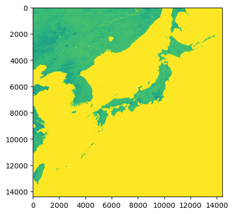
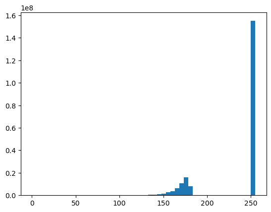
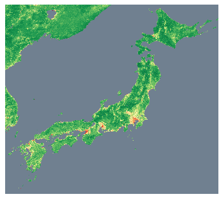
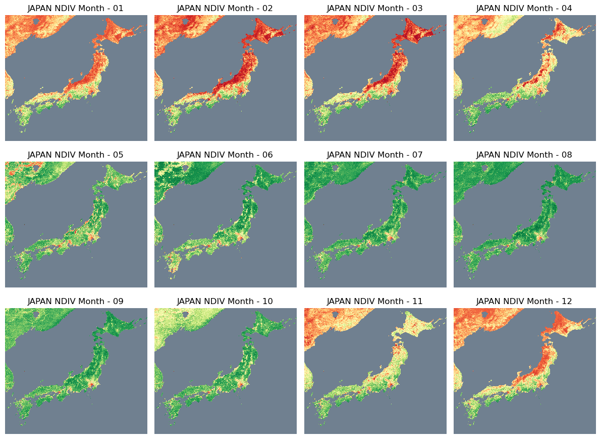

# Remote Sensing Vegetation Index of Japan 

The normalized difference vegetation index (NDVI) may be the most widely used vegetation index. To calculate NDVI you simply need appropriate imagery and a program that allows you to interact with the image data. 

## What is NDVI and Why is it Used?
NDVI measures the ratio of the reflective difference in the red and near-infrared portions of the spectrum to the sum of red and near-infrared reflectance. Green, healthy vegetation reflects light in the near-infrared portion of the spectrum and absorbs red light. NDVI ranges from values of 1.0 to -1.0 where larger, positive values indicate green vegetation.

NDVI is used in many different applications. Specifically, it is an important indicator of the amount and quality of forage for wildlife and livestock. NDVI is also used to assess agricultural fields and identify the location and extent of surface water.

## The NDVI Equation

$$ NDVI = \frac{NIR – Red}{NIR + Red} $$

where Red and NIR stand for the spectral reflectance measurements acquired in the red (visible) and near-infrared regions, respectively.

NDVI values range from +1.0 to -1.0. Areas of barren rock, sand, or snow usually show very low NDVI values (for example, 0.1 or less). Sparse vegetation such as shrubs and grasslands or senescing crops may result in moderate NDVI values (approximately 0.2 to 0.5). High NDVI values (approximately 0.6 to 0.9) correspond to dense vegetation such as that found in temperate and tropical forests or crops at their peak growth stage. 

Sometimes for convinience or storage purpose, a linear transformation on the NDVI index will be placed so as to stretch the [-1,1] to a bigger integer range. For example in the data published by [Geospacial Information Authority of Japan](https://www.gsi.go.jp/kankyochiri/ndvi_e.html), a transformation converted the standard NDVI from [-1,1] to [0,200] with this linear transformation. 

$$ NDVI_{revised} = (NDVI + 1.0) * 100 $$

We will then try to use the data to visualize the monthly NDVI of data aquired from GIAJ for year 2012. 


```python
import rasterio
import rasterio.plot
import pyproj
import numpy as np
import matplotlib
import matplotlib.pyplot as plt
```


```python
# image size specified on data source 
ROWS = 14400    
COLS = 14400

file = open('japan/201208-NDVI_250.raw')  
print(file)
```

    <_io.TextIOWrapper name='japan/201208-NDVI_250.raw' mode='r' encoding='UTF-8'>


It turns out the data provided by GIAJ is not in typical raster format but rather a raw file that is storing the binary data without header. Hence the following process should reshape the single array into image sizes for visualization purpose. 


```python
# For raw image (without any headers)
input_file = 'japan/201207-NDVI_250.raw'
data = np.fromfile(input_file, dtype=np.uint8)
imageSize = (ROWS, COLS)
npimg = data.reshape(imageSize)
plt.imshow(npimg)
```


    <matplotlib.image.AxesImage at 0x124655e20>


    

    


The first attempt of visualization is working however there are a few issues:
- Color makes no sense and is skewed towards green, which doesn't provide any information visually, this can be solved by choosing a better color map. 
- A focus view of Japan would be nicer to see the details of islands in Japan

To resolve the issues, we can first have a look what is the distribution of calculated NDVI look like. 


```python
plt.hist(data, bins=50);
```


    

    


It turns out all missing values are assigned 255 in the raw data, hence the color is skewed in the final plot. Hence some data cleaning is necessary for providing a clean view. 


```python
def data_plot_month(month):
    
    input_file = 'japan/2012{month}-NDVI_250.raw'.format(month=month)
    data = np.fromfile(input_file, dtype=np.uint8)
    data = data.astype(np.float32)
    
    # remove all missing value and replace with nan
    data[data==255]=  np.nan
    data[data==0]=  np.nan
    
    # resize single array into image size 
    imageSize = (ROWS, COLS)
    npimg = data.reshape(imageSize)

    # select scope of focus 
    npimg = npimg[2000:10000,4000:13000] 
    return npimg

# chosse a color map that has green when index is high and red while low 
current_cmap = matplotlib.cm.RdYlGn

# mask all missing value  with a different color
current_cmap.set_bad(color='slategrey')

# plot 2012-07 NDVI data 
imgplot = plt.imshow(data_plot_month('07'), cmap = current_cmap, interpolation='nearest')
plt.axis('off')
```


    (-0.5, 8999.5, 7999.5, -0.5)


    

    


A lot of green for vegetation in July, so the viz looks correct. Now I'll try to view how monthly data evolves across an entire year. 


```python
fig, axs = plt.subplots(nrows=3, ncols=4, figsize=(12, 9),
                        subplot_kw={'xticks': [], 'yticks': []})


months = ['01','02','03','04','05','06','07','08','09','10','11','12']
for ax, month in zip(axs.flat, months):
    #ax.imshow(grid, interpolation=interp_method, cmap='viridis')
    #data_plot_month('01')
    current_cmap = matplotlib.cm.RdYlGn
    current_cmap.set_bad(color='slategrey')
    ax.imshow(data_plot_month(month), cmap = current_cmap, interpolation='nearest')
    ax.axis('off')
    ax.set_title('JAPAN NDIV Month - '+month)

plt.tight_layout()
plt.show()
```


    

    


Looks ok with seasonal ndvi showing correct vegetation trend from Jan to Dec! 
